## 博客后台管理系统

&emsp;&emsp;该项目是基于react全家桶（React、React-router-dom、redux、styled-components）开发的一套博客后台管理系统，用于[前端小站](https://lefrit.com)的管理，主要功能包括游客浏览、文章管理、类别管理、评论通知、推荐设置和用户管理

### 访问地址

&emsp;&emsp;域名：[https://admin.lefrit.com](https://admin.lefrit.com)

&emsp;&emsp;Github: [https://github.com/littlematch0123/blog-admin](https://github.com/littlematch0123/blog-admin)

&emsp;&emsp;或者可以直接扫描二维码访问


### 项目介绍

&emsp;&emsp;采用移动优先的响应式布局，移动端、桌面端均可适配；字体大小使用em单位，桌面端的文字相应变大；移动端大量使用滑屏操作，桌面端通过光标设置、自定义滚动条、回车确定等，提升交互体验

&emsp;&emsp;根据HTML标签内容模型，使用语义化标签，尽量减少标签层级，尽量使用React.Fragment来代替div

&emsp;&emsp;采用统一的色调处理，除了黑白两色外，所有页面共使用了8种颜色，保证了页面颜色素雅、统一

&emsp;&emsp;使用service worker实现了离线缓存，配置了robots，禁止搜索引擎抓取页面

&emsp;&emsp;使用styled-components插件，实现css in JS。所有图标资源均采用svg格式，并存储到common/BaseImg组件中，方便管理，图片资源均上传到七牛云图床，使用外链访问。最终，html、css、image都使用js管理

&emsp;&emsp;没有引用第三方组件库，如bootstrap或蚂蚁设计，而是自己开发了项目中所需的公共组件。在common目录下，封装了头像、筛选框、全屏、loading、遮罩、搜索框、滑屏、联动选择等组件，方便开发

&emsp;&emsp;功能组件按照功能（Post、Comment...）而不是角色（controllers、models、views）分类，将展示组件component和容器组件container整合为一个文件

&emsp;&emsp;状态管理借鉴了vuex的管理模式，action-types、action、reducer、selecter、state整合到每个模块目录的module.js文件下。为了方便扩展，所有的state都设置了filter字段

&emsp;&emsp;使用配置数据，实现了数据和应用分离，配置数据包括API调用地址和颜色值，以常量的形式存储在constants目录下

&emsp;&emsp;使用esLint规范JS代码，代码风格参照airbnb规范，所有命名采用驼峰写法，公共组件以Base为前缀，函数大多以get或set为前缀，事件函数以on为前缀，异步函数以async为后缀，布尔值基本以do或is为前缀

&emsp;&emsp;使用styleLint规范CSS代码，按照布局类属性、盒模型属性、文本类属性、修饰类属性的顺序编写代码，并使用order插件进行校验

&emsp;&emsp;使用react最新版本的方法，包括createRef()、getDerivedStateFromProps生命周期、 React.Fragment语法糖等

&emsp;&emsp;进行了代码优化，包括减少请求数量（文件合并 、小图片使用Base64、使用301而不是302重定向、静态资源使用强缓存、接口资源使用协商缓存、使用离线缓存、长缓存优化、CSS内联），减小资源大小（文件压缩、andriod下使用webp格式图片、开启gzip），优化网络连接（使用DNS预解析、使用keep-alive持久连接、使用HTTP2管道化连接），优化资源加载（优化资源加载位置、图片懒加载），减少重绘回流（减少兄弟选择器、动画元素硬件渲染、使用函数节流、及时清理环境）

&emsp;&emsp;该项目的一个隐藏彩蛋是摇一摇功能，可以直接摇到前台页面，当然也可以再摇回来

&emsp;&emsp;最终优化评分如下所示


### 功能演示

&emsp;&emsp;功能主要包括游客浏览、评论通知、用户管理、推荐设置、文章管理和类别管理

【游客浏览】

&emsp;&emsp;在没有管理员帐号的情况下，可以点击游客浏览进入后台。但是，游客只有浏览权限，没有操作权限

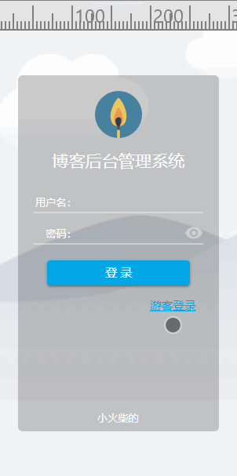


【评论通知】

&emsp;&emsp;有新评论未查看时，右上角快捷菜单上会出现评论通知的按钮。查看评论后，通知按钮消失

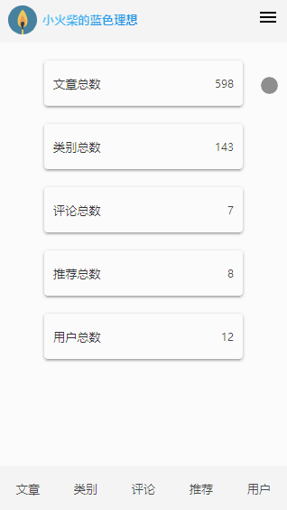


【用户管理】

&emsp;&emsp;用户管理包括查看所有用户信息、查看用户点赞情况、查看用户评论情况、按用户名拼音排序、按点赞数排序、按评论数排序以及设置用户状态

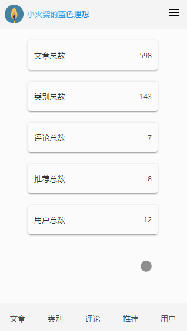


【推荐管理】

&emsp;&emsp;推荐管理包括文章推荐和专题推荐两类

&emsp;&emsp;1、文章推荐

&emsp;&emsp;文章推荐的功能包括更改推荐文章、更改背景图和更改次序

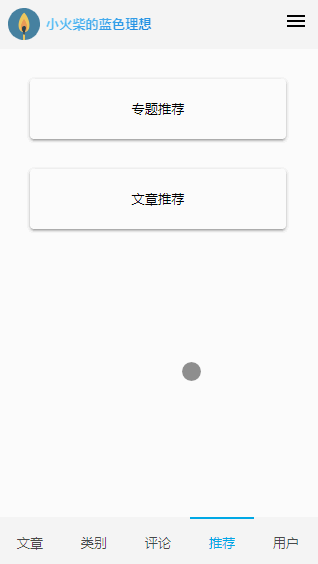


&emsp;&emsp;2、专题推荐

&emsp;&emsp;专题推荐的功能包括更改推荐专题、更改专题说明和更改次序

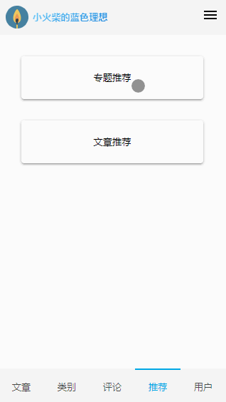

【文章管理】

&emsp;&emsp;文章管理包括文章筛选、文章搜索、新建文章、编辑文章、删除文章、设置配图、查看点赞等功能

&emsp;&emsp;1、文章筛选

&emsp;&emsp;初始页显示全部文章，设置类别后，只显示筛选后的文章，文章查阅完成后，可返回文章筛选页

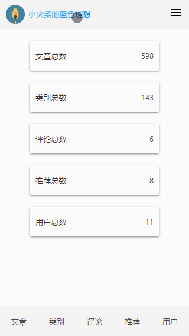

&emsp;&emsp;2、文章搜索

&emsp;&emsp;初始页只显示搜索框，设置搜索词后，显示出相关文章，但每次只显示16篇，下拉刷新后，可继续显示。文章查阅完成后，可返回文章搜索页

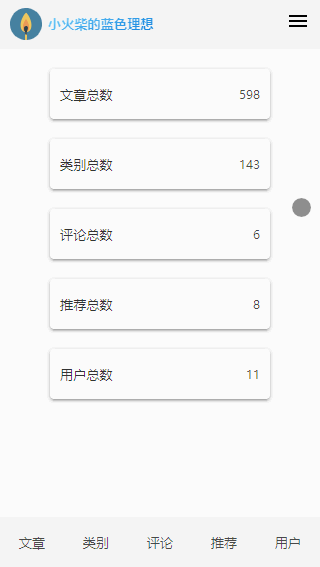


&emsp;&emsp;3、新建文章

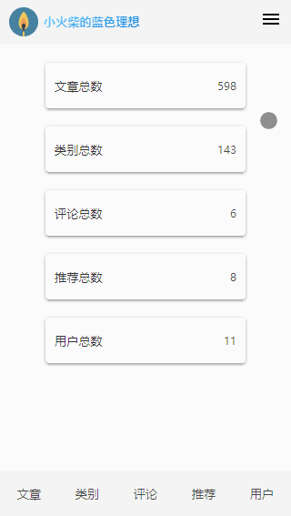


&emsp;&emsp;4、编辑文章

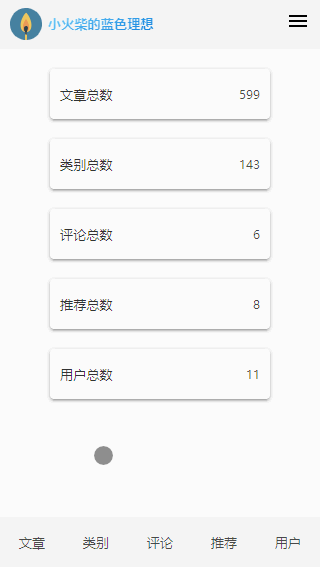

&emsp;&emsp;5、设置配图

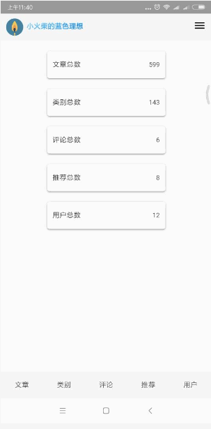


&emsp;&emsp;6、查看点赞和评论并删除文章

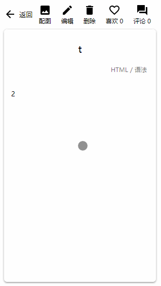

【类别管理】

&emsp;&emsp;类别管理包括查看类别、添加类别、编辑类别、删除类别

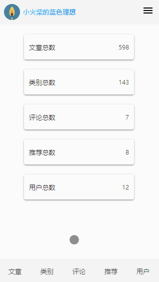

### 目录结构

&emsp;&emsp;src目录下，包括assets(静态资源)、common(公共组件)、components(功能组件)、constants(常量配置)、store(redux)和utils(工具方法)这6个目录

```
- assets // 存放静态资源，包括通用CSS和图片
    global.css // 全局CSS
    login_bg.jpg // 登录框背景图
- common // 存放公共组件
    BaseArticle.js // 文章组件
    BaseAvatar.js // 头像组件
    ...
- components // 存放功能组件
    Category // 类别组件
      AddCategory.js // 类别添加组件
      DeleteCategory.js // 类别删除组件
      UpdateCategory.js // 类别更新组件
      Category.js // 类别路由组件
      CategoryForm.js // 类别基础组件
      CategoryItem.js // 类别项组件
      CategoryItemList.js // 类别列表组件
      CategoryRootList.js // 类别根列表组件
      module.js //类别状态管理
      ...
- constants // 存放常量配置
    API.js // 存放API调用地址
    Colors.js // 存放颜色值
- store // 存放redux
    index.js
- utils // 存放工具方法
    async.js // fetch方法
    history.js // 路由方法
    util.js // 其他工具方法
```
【公共组件】

&emsp;&emsp;没有引用第三方组件库，如bootstrap或蚂蚁设计，而是自己开发了项目中所需的公共组件

&emsp;&emsp;封装了文章组件、头像组件、返回组件、徽章组件、按钮组件、卡片组件、筛选框组件、全屏组件、图片组件、输入框组件、loading组件、遮罩组件、搜索框组件、滑屏组件、多行输入框组件、标题组件、面包屑组件、按钮组组件、反色按钮组件、自适应按钮组件、密码框组件和联动选择组件

```
BaseArticle.js  // 文章组件
BaseAvatar.js // 头像组件
BaseBack.js // 返回组件
BaseBadge.js  // 徽章组件
BaseButton.js // 按钮组件
BaseCard.js // 卡片组件
BaseFilterList.js // 筛选框组件
BaseFullScreen.js // 全屏组件
BaseImg.js  // 图片组件
BaseInput.js  // 输入框组件
BaseLoading.js  // loading组件
BaseMask.js // 遮罩组件
BaseSearchBox.js  // 搜索框组件
BaseSwipeItem.js  // 滑屏组件
BaseTextArea.js // 多行输入框组件
BaseTitle.js  // 标题组件
BreadCrumb.js // 面包屑组件
ButtonBox.js  // 按钮组组件
ButtonInverted.js // 反色按钮组件
ButtonWithAutoWidth.js  // 自适应按钮组件
InputPassword.js  // 密码框组件
LinkageSelector.js // 联动选择组件
```
【功能组件】

&emsp;&emsp;按照功能来设置目录，如下所示

```
弹出框(Alert)
登录框(Auth)
类别管理(Category)
评论管理(Comment)
主页(Home)
点赞管理(Like)
文章管理(Post)
七牛传图(Qiniu)
推荐设置(Recommend)
页面尺寸(Size)
用户管理(User)
```


### 整体思路

【全屏布局】

&emsp;&emsp;使用设置高度的全屏布局方式，主要通过calc来实现

```
  <section style={{ height: `${wrapHeight}px` }}>
    <HomeHeader />
    <Inner>
        ...
    </Inner>
    <HomeNav />
  </section>
```
```
const Header = styled.header`
  height: 50px;
`
const Inner = styled.main`
  height: calc(100% - 100px);
  background: ${PRIMARY_BG_COLOR};
`
const List = styled.nav`
  height: 50px;
`
```
【层级管理】

&emsp;&emsp;项目的层级z-index，只使用0-3

&emsp;&emsp;全屏的弹出框优化级最高，设置为3；侧边栏设置为2；页面元素默认为0，如有需要，要设置为1

【全局弹出层】

&emsp;&emsp;在入口文件app.js中设置全局的弹出层和loading，所有组件都可以共用

```
// app.js
  render() {
    const { doShowLoading, alertText, hideAlertText } = this.props
    return (
      <React.Fragment>
        { doShowLoading && <AlertWithLoading /> }
        { !!alertText && <AlertWithText text={alertText} onExit={hideAlertText} />}
        <Router history={history} >
            ...
        </Router>
      </React.Fragment>
    )
  }
```
【路由管理】

&emsp;&emsp;react-router-dom第四版采用了动态路由，在组件目录内，以组件同名文件保存该组件内的路由

```
// category.js
const Category = () =>
  (
    <Switch>
      <Route exact path="/categories" component={CategoryRootList} />
      <Route exact path="/categories/:id" component={CategoryItemList} />
      <Route path="/categories/:id/add" component={AddCategory} />
      <Route path="/categories/:id/update" component={UpdateCategory} />
      <Route path="/categories/:id/delete" component={DeleteCategory} />
    </Switch>
  )
```
【状态管理】

&emsp;&emsp;参照vuex的状态管理方式，将每个组件的状态管理命名为module.js，保存在当前组件目录下

```
import auth from '@/components/Auth/module'
import size from '@/components/Size/module'
import alert from '@/components/Alert/module'
import categories from '@/components/Category/module'
import posts from '@/components/Post/PostsModule'
import post from '@/components/Post/PostModule'
import comments from '@/components/Comment/module'
import likes from '@/components/Like/module'
import qiniu from '@/components/Qiniu/module'
import users from '@/components/User/module'

const rootReducer = combineReducers({
  auth, size, alert, categories, posts, post, comments, likes, qiniu, users
})
```
&emsp;&emsp;每个模块的状态都设置有filter字段，方便扩展

```
// action-types
export const SET_COMMENTS_FILTER = 'SET_COMMENTS_FILTER'

// state
const initialState = {
  filter: null,
  docs: []
}

// action
export const setCommentsFilter = filter => dispatch => new Promise(resolve => {
  resolve()
  dispatch({ type: SET_COMMENTS_FILTER, filter })
})

// reducer
const comments = (state = initialState, action) => {
  switch (action.type) {
  case SET_COMMENTS_FILTER:
    return { ...state, filter: action.filter }

}
export default comments

// selector
export const getCommentsFilter = state => state.comments.filter
```
【数据传递】

&emsp;&emsp;组件间的数据传递方式一般有三种，一种是使用react中的函数传参，另一种是使用路由的location属性，还有一种是通过redux

&emsp;&emsp;1、函数传参

```
// PostRecommendItem
<BaseSearchBox
  searchText={title}
  datas={posts}
  onInput={this.onInput}
  onBack={() => { this.setState({ doShowSearchBox: false }) }}
/>

  onInput = data => {
    this.setState({ doShowSearchBox: false })
    const { updatePostAsync, showAlertText } = this.props
    const { prevData, datas } = this.statethis.setState({
        datas: datas.map(t => {
          if (t.number === data.number) return data
          return t
        })
      })
    ...
  }

// BaseSearchBox
<List innerRef={this.scrollRef}>
  {resultDatas.map(t =>
    <Item key={t._id} onClick={() => { onInput && onInput(t) }}>{t.title}</Item>)}
  {resultDatas.length >= limitNumber && !doNeedMoreDatas &&
    <ExtendedItem>已经到底了...</ExtendedItem>}
</List>
```
&emsp;&emsp;2、location传递state

```
// CommentForm
  constructor(props) {
    super(props)
    const { operate, location } = props
    if (operate === 'update' && location.state) {
      const { content } = location.state.comment
      this.state = { content }
    } else {
      this.state = { content: '' }
    }
  }

// CommentList
history.push({ pathname: `${BasePostUrl}/comments/${t._id}/update`, state: { comment: t } })
```
&emsp;&emsp;3、使用redux

```
//CategoryForm.js
  componentDidMount() {
    const { operate, match, setCategoriesFilter } = this.props
    setCategoriesFilter(Number(match.params.id)).then(() => {
      if (operate === 'update') {
        const { category } = this.props
        const { name, description } = category
        if (name) {
          this.setState({ name, description })
        } else {
          history.push(`/categories/${getParentNumber(Number(match.params.id))}`)
        }
      }
    })
  }
const mapStateToProps = state => ({
  category: getCategoryByFilter(state)
})
export default connect(mapStateToProps, { setCategoriesFilter })(CategoryForm)
```


### 项目优化

【子页面刷新】

&emsp;&emsp;子页面刷新时，可能会出现得不到从父级传递过来的数据的情况，笔者的处理是跳转到父级页面

```
  componentDidMount() {
    const { operate, location, match } = this.props
    if (operate === 'update' && !location.state) {
      history.push(`/posts/${match.params.postId}/comments`)
    }
  }
```
【reselect】

&emsp;&emsp;通过reselect来保存状态，减少状态查询，提升性能

```
export const getRecommendedCategories = createSelector(getCategories,
  datas => datas.filter(t => t.recommend).sort((a, b) => a.index - b.index))
```
【promise】

&emsp;&emsp;为action添加Promise，方便状态改变后的处理
```
export const setCategoriesFilter = filter => dispatch => new Promise(resolve => {
  resolve()
  dispatch({ type: SET_CATEGORIES_FILTER, filter })
})
```
【组件共用】

&emsp;&emsp;由于编辑和新建组件用到的元素是一样的，只不过，新建组件时内容为空，编辑组件时需要添加内容，这时就可以复用组件
```
const AddCategory = ({ match }) => <CategoryForm match={match} operate="add" />
const UpdateCategory = ({ match }) => <CategoryForm match={match} operate="update" />
```
【清理环境】

&emsp;&emsp;如果使用addEventListener绑定了事件处理函数，在组件销毁的时候，要及时清理环境

```
  componentDidMount() {
    this.scrollRef.current.addEventListener('scroll', throttle(this.onScroll))
  }
  componentWillUnmount() {
    this.scrollRef.current.removeEventListener('scroll', throttle(this.onScroll))
  }
```
【生命周期函数】

&emsp;&emsp;1、使用getDerivedStateFromProps生命周期函数时，如果不设置constructor，会有如下警告
```
Did not properly initialize state during construction. Expected state to be an object, but it was undefined.
```
&emsp;&emsp;添加空state即可解决
```
  constructor(props) {
    super(props)
    this.state = {}
  }
```
&emsp;&emsp;2、使用componentDidMount生命周期函数时，如果在该函数中直接使用this.setState()，会有如下警告
```
Do not use setState in componentDidMount  react/no-did-mount-set-state
```
&emsp;&emsp;将state设置转移到then方法，或者另一个函数中即可

```
componentDidMount() {
  this.test()
}
test() {
  this.setState({ name: '' })
}
```
【应用和数据分离】

&emsp;&emsp;使用配置数据，实现数据和应用分离，配置数据包括API调用地址和颜色值，以常量的形式存储在constants目录下

```
// API.js
let API_HOSTNAME
if (process.env.NODE_ENV === 'development') {
  API_HOSTNAME = '/local'
} else {
  API_HOSTNAME = '/api'
}

export const BASE_AUTH_URL = `${API_HOSTNAME}/auth/admin`
export const BASE_USER_URL = `${API_HOSTNAME}/users`
export const BASE_POST_URL = `${API_HOSTNAME}/posts`
export const BASE_TOPIC_URL = `${API_HOSTNAME}/topics`
export const BASE_CATEGORY_URL = `${API_HOSTNAME}/categories`
export const BASE_LIKE_URL = `${API_HOSTNAME}/likes`
export const BASE_COMMENT_URL = `${API_HOSTNAME}/comments`
export const BASE_RECOMMEND_URL = `${API_HOSTNAME}/recommends`
export const BASE_QINIU_URL = `${API_HOSTNAME}/qiniu`
export const STATIC = 'https://blog.lefrit.com/static'
export const CLIENT_URL = 'https://www.lefrit.com'

// Colors.js
export const PRIMARY_COLOR = '#00a8e5'
export const DARK_COLOR = '#0066cc'
export const ERROR_COLOR = '#f67280'
export const PRIMARY_BG_COLOR = '#fafafa'
export const TRANSPARENT_BG_COLOR = 'rgba(7, 17, 27, .4)'
export const DARK_BG_COLOR = '#f5f5f5'
export const PRIMARY_LINE_COLOR = '#eee'
export const DARK_LINE_COLOR = '#ebedf0'
```
【函数节流】

&emsp;&emsp;为触发频率较高的函数使用函数节流

```
/**
 * 函数节流
 * @param {fn} function test(){}
 * @return {fn} function test(){}
 */
export const throttle = (fn, wait = 100) => function func(...args) {
  if (fn.timer) return
  fn.timer = setTimeout(() => {
    fn.apply(this, args)
    fn.timer = null
  }, wait)
}
```


### 功能实现

【登录设置】

&emsp;&emsp;将用户信息保存到sessionStorage中并检测，如果不存在，则跳转到登录页面

```
<Router history={history} >
  <Switch>
    <Route path="/login" component={AuthLogin} />
    <Route
      path="/"
      render={props => {
        if (sessionStorage.getItem('token') && sessionStorage.getItem('user')) {
          return <Home {...props} />
        }
        return <Redirect to="/login" />
      }}
    />
  </Switch>
</Router>
```
【全角空格占位】

&emsp;&emsp;使用全角空格占位，从而使文字对齐
```
<Label htmlFor="username">用户名：</Label>
<Label htmlFor="password">&emsp;密码：</Label>
```
【一像素边框】

&emsp;&emsp;将伪元素高度设置为1px，然后用 transform缩小到原来的一半

```
div {
  position: relative;
  &::after {
    position: absolute;
    left: 0;
    right: 0;
    height: 1px;
    transform: scaleY(.5);
    content: '';
  }
`
```
【缓动弹出层】

&emsp;&emsp;过渡弹出层有两种实现方式，包括transition和animation，该项目使用transition的方式实现
```
<StyledMask className={doShowMenuList ? 'mask-show' : ''} />
<StyledList className={doShowMenuList ? 'transform-show' : ''} />
```
```
const StyledList = styled(HomeMenuList)`
  transform: translateY(-100%);
  transition: .2s;
`
const StyledMask = styled(BaseMask)`
  z-index: 2;
  display: none;
`
const MenuBox = styled.div`
  cursor: pointer;
  & .transform-show {
    transform: translateY(0);
  }
  & .mask-show {
    display: block;
  }
`
```
【图标管理】

&emsp;&emsp;所有的图标都使用SVG格式，存储在common/BaseImg.js文件中

```
// BaseImg.js
...
export const Home = props => (
  <svg height={24} viewBox="0 0 24 24" width={24} {...props}>
    <path d="M10 20v-6h4v6h5v-8h3L12 3 2 12h3v8z" />
    <path d="M0 0h24v24H0z" fill="none" />
  </svg>
)
```
【搜索实现】

&emsp;&emsp;处理搜索功能时，需要特别处理正则表达式中的元字符
```
  static getReg(searchText) {
    return new RegExp(searchText.replace(/[[(){}^$|?*+.\\-]/g, '\\$&'), 'ig')
  }
```
&emsp;&emsp;如果将间隔符-放在中间，大写字母，如V会被匹配为/V
```
return new RegExp(searchText.replace(/[[(){}^$|?*+.-\\]/g, '\\$&'), 'ig')
```
&emsp;&emsp;此时的-被识别为范围间隔符，相当于.到\之间的字符，正好包括了所有的大写字母，所以。一定要把-放在最后


【滑屏实现】

&emsp;&emsp;滑屏主要通过touch事件来实现，一般地，有两种形式。一种是当前元素滑动，另一种是其他元素滑动。该项目采用较简单的第二种

```
  static checkSwipe(absMove, duration) {
    const THRESHOLD = 10
    const SHORTESTTIME = 300
    // 距离大于10，且时间小于300ms，才算做一次滑动
    return Boolean(absMove > THRESHOLD && duration < SHORTESTTIME)
  }
  onTouchStart = e => {
    this.startTime = new Date().getTime()
    this.startX = e.targetTouches[0].pageX
    this.startY = e.targetTouches[0].pageY
  }
  onTouchEnd = e => {
    const { pageX, pageY } = e.changedTouches[0]
    // 如果y轴移动距离大于元素高度，说明手指已经移出元素本身，则取消滑动
    if (pageY - this.startY > this.clientHeight) {
      return false
    }
    const moveX = pageX - this.startX
    const duration = new Date().getTime() - this.startTime
    // 如果符合滑动要求，且向左滑动，则控制条滑出
    if (BaseSwipeItem.checkSwipe(Math.abs(moveX), duration) && moveX < 0) {
      this.setState({ doShowControlBox: true })
    } else {
      this.setState({ doShowControlBox: false })
    }
    return true
  }
```
【密码框实现】

&emsp;&emsp;密码框的右侧一般都有一个小图标用于显示密码

```
<Wrap className={className} {...rest} >
  <StyledInput
    id="password"
    textIndent={textIndent}
    color={color}
    value={value}
    onChange={onChange}
    type={doShowPassword ? 'password' : 'text'}
  />
  { doShowPassword ?
    <Visibility onClick={onChangeStatus} />
    : <VisibilityOff onClick={onChangeStatus} />
  }
</Wrap>
```
【fetch函数封装】

&emsp;&emsp;该项目是基于create-react-app构建的，自带fetch功能。封装fetch函数到utils目录下的async.js文件中，将loading组件、alert组件整合到fetch函数的整个数据获取过程中

```
import { showLoading, hideLoading, showAlertText, hideAlertText } from '@/components/Alert/module'
import { logout } from '@/components/Auth/module'

const async = ({ dispatch, url, method, data, headers, success, fail, doHideAlert }) => {
  // 显示loading
  dispatch(showLoading())
  let fetchObj = {}
  if (method) {
    fetchObj = {
      method,
      body: JSON.stringify(data),
      headers: new Headers({ ...headers, 'Content-Type': 'application/json' })
    }
  }
  fetch(url, fetchObj).then(res => {
    // 关闭loading
    dispatch(hideLoading())
    return res.json()
  }).then(json => {
    // 成功
    if (json.code === 0) {
      !doHideAlert && dispatch(showAlertText(json.message))
      setTimeout(() => {
        dispatch(hideAlertText())
      }, 1000)
      success && success(json.result)
      // 自定义错误
    } else if (json.code === 1) {
      dispatch(showAlertText(json.message))
      // 系统错误
    } else if (json.code === 2) {
      dispatch(showAlertText(json.message))
      fail && fail(json.err)
      // 认证失败
    } else if (json.code === 3) {
      dispatch(showAlertText(json.message))
      dispatch(logout)
      // 权限不足
    } else if (json.code === 4) {
      dispatch(showAlertText(json.message))
    }
  }).catch(() => {
    dispatch(showAlertText('服务器故障'))
  })
}

export default async
```
【组件内路由】

&emsp;&emsp;如果要在组件内使用路由功能，可封装utils/history.js文件
```
// utils/history.js
import createBrowserHistory from 'history/createBrowserHistory'
const customHistory = createBrowserHistory()
export default customHistory
```
&emsp;&emsp;Router中使用history={history}，而不是BrowserRouter

```
// app.js
import history from '@/utils/history'
<Router history={history} >
  <Switch>
    <Route path="/login" component={AuthLogin} />
    <Route
      path="/"
      render={props => {
        if (sessionStorage.getItem('token') && sessionStorage.getItem('user')) {
          return <Home {...props} />
        }
        return <Redirect to="/login" />
      }}
    />
  </Switch>
</Router>
```
&emsp;&emsp;然后，在组件中引用即可
```
import  history  from '@/utils/history'
// 跳转到首页
history.push('/')
```

### 兼容处理

【虚拟键盘】

&emsp;&emsp;andriod下，虚拟键盘会影响可视区域的高度；而IOS下，不会影响
```
可视区域高度 = document.documentElement.clientHeight - 虚拟键盘的高度;
```
&emsp;&emsp;bug重现如下：


&emsp;&emsp;所以，要将包含input域的页面高度设为固定

&emsp;&emsp;在页面初始化时，获取页面高度

```
// app.js
  componentDidMount() {
    const { setWrapSize } = this.props
    const { clientHeight, clientWidth } = document.documentElement
    setWrapSize({ clientHeight, clientWidth })
    window.addEventListener('orientationchange', this.setSize)
  }
```
&emsp;&emsp;然后通过行间样式，将此高度设置到包含input域的页面上
```
// BaseFullScreen
<Wrap className={className} style={{ height: `${wrapHeight}px` }} {...rest}>{children}</Wrap>
```
【取消自动大写】

&emsp;&emsp;IOS下，input域会自动大写首字母，设置autoCapitallize="off"即可
```
const BaseInput = ({ value, onChange, ...rest }) =>
  <Input {...rest} value={value} onChange={onChange} autoComplete="off" autoCapitalize="off" />
```
【光标颜色】

&emsp;&emsp;默认情况下，光标颜色与字体颜色color相同，但也可以通过caret-color属性来单独设置

&emsp;&emsp;但是，IOS的光标不支持caret-color，与字体颜色无关，默认为紫蓝色。所以，尽量不要设置蓝色或紫色背景，否则光标看不清楚

【页面放大】

&emsp;&emsp;IOS下，input获取焦点时会放大


&emsp;&emsp;meta设置user-scalable=no，可取消放大效果

```
<meta name="viewport" content="width=device-width, initial-scale=1, user-scalable=no, shrink-to-fit=no">
```
【圆角】

&emsp;&emsp;IOS下，input域只显示底边框时，会出现底边圆角效果


&emsp;&emsp;设置border-radius:0即可

```
border-radius:0
```
【轮廓outline】

&emsp;&emsp;android浏览器下，input域处于焦点状态时，默认会有一圈淡黄色的轮廓outline效果

&emsp;&emsp;通过设置outline:none可将其去除
```
outline: none
```
【点击背景】

&emsp;&emsp;在移动端，点击可点击元素时，android下会出现淡蓝色背景，IOS下会出现灰色背景

&emsp;&emsp;bug重现如下：


&emsp;&emsp;可以通过-webkt-tap-hightlight-color属性的设置，取消点击时出现的背景效果
```
* {
  -webkit-tap-highlight-color: rgba(0, 0, 0, 0);
}
```
【局部不滚动】

&emsp;&emsp;IOS下，可能会出现局部滚动不流畅，甚至局部不滚动的bug

&emsp;&emsp;下列动画中，滑动到代码片段时，由于代码本身具有滚动条，则发生滚动无效的情况


&emsp;&emsp;通过在该元素上设置overflow-scrolling属性为touch即可解决
```
div {
  -webkit-overflow-scrolling: touch;
}
```
【高度无效】

&emsp;&emsp;在IOS下，设置height:100%，如果父级的flex值为1，而没有设置具体高度，则100%高度设置无效

&emsp;&emsp;处理方法是，在父级通过计算来设置具体高度height，如height: calc(100% - 100px)

【shrink-to-fit=no】

&emsp;&emsp;IOS9+系统下，使用Viewport元标记"width=device-width"会导致页面缩小以适应溢出视口边界的内容。可以通过添加"shrink-to-fit=no"到meta标签来覆盖此行为，增加的值将阻止页面缩放以适应视口
```
<meta name="viewport" content="width=device-width, initial-scale=1.0, maximum-scale=1.0, user-scalable=no，shrink-to-fit=no">
```
